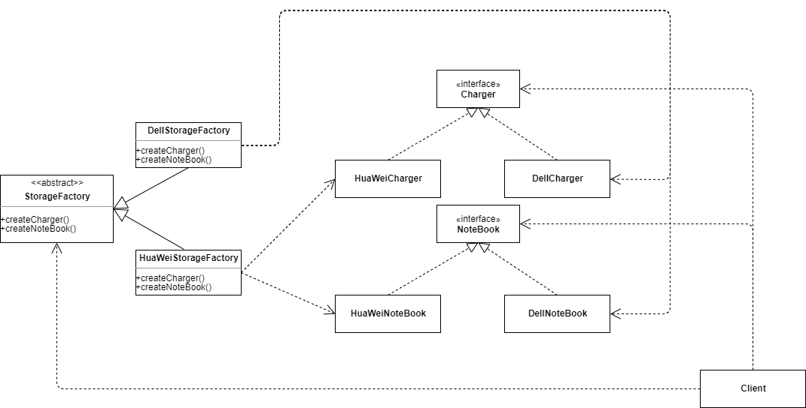
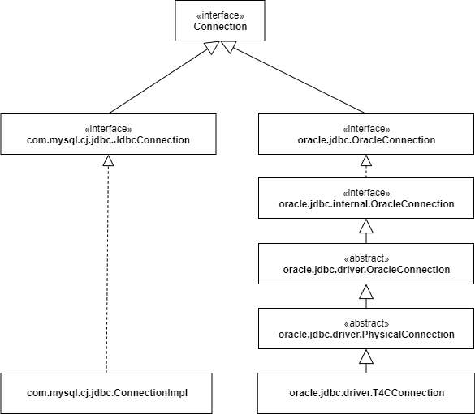
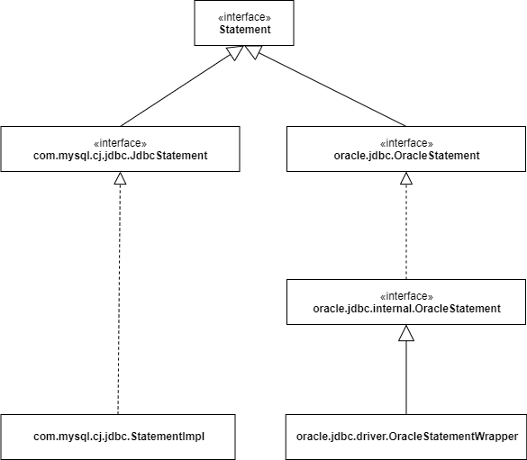
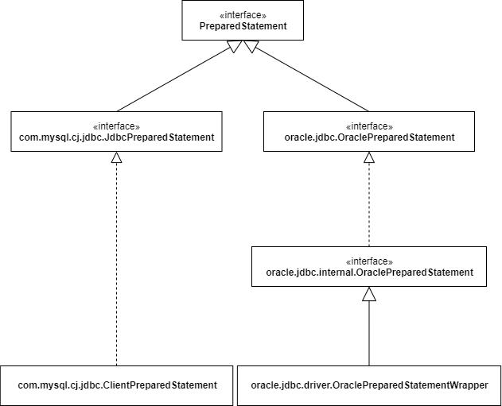
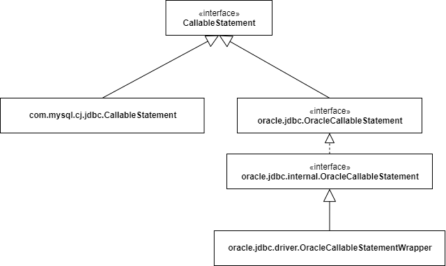
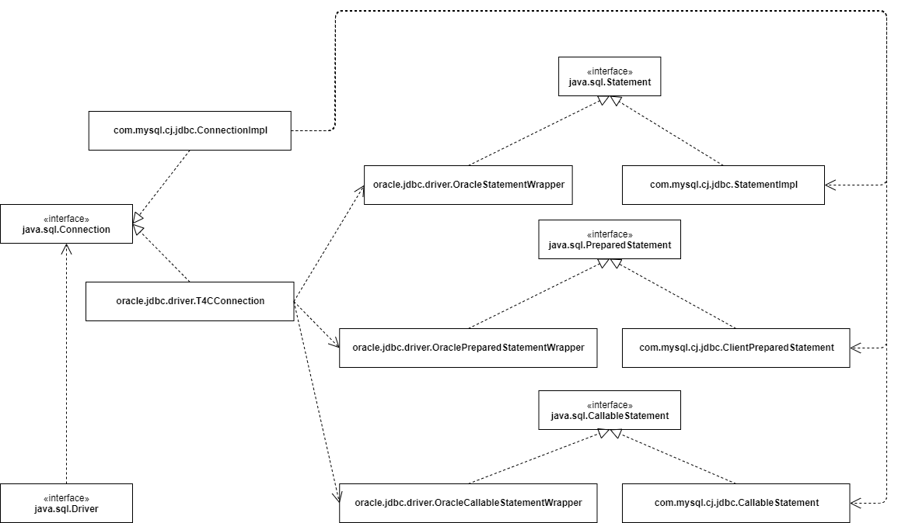

# 抽象工厂模式(AbstractFactory)
[返回首页](../../../../../README.md)
- [文件结构](#文件结构)
- [目的](#目的)  
- [例子](#例子)  
- [Java代码示例](#Java代码示例)  
    * [库房(抽象工厂)](#库房)
    * [戴尔库房(具体工厂)](#戴尔库房)
    * [华为库房(具体工厂)](#华为库房)
    * [充电器(抽象产品)](#充电器)
    * [笔记本(抽象产品)](#笔记本)
    * [戴尔笔记本(具体产品)](#戴尔笔记本)
    * [华为笔记本(具体产品)](#华为笔记本)
    * [华为充电器(具体产品)](#华为充电器)
    * [戴尔充电器(具体产品)](#戴尔充电器)
    * [Client](#Client)
- [Java源码中抽象工厂模式的案例](#Java源码中抽象工厂模式的案例)
    * [Connection](#Connection)
    * [Statement](#Statement)
    * [PreparedStatement](#PreparedStatement)
    * [CallableStatement](#CallableStatement)
    * [JDBC抽象工厂UML图](#JDBC抽象工厂UML图)
- [Spring源码中抽象工厂模式的案例](#Spring源码中抽象工厂模式的案例)
# 文件结构
├─csdn(文章中的源码)  
│  ├─factory  
│  └─product  
├─examples(书中例子源码)  
│  ├─factory  
│  └─product  
├─img(文中图片)  
└─improvement(书中原始例子改良)  
│  ├─factory  
│  └─product  
# 目的  
提供一个创建一系列相关或互相依赖对象的接口，而无需指定他们具体的类  
# 例子  
你是一个笔记本商家，现在在出售华为与戴尔笔记本电脑(假设每种品牌只有一种产品)每个商品由充电器与笔记本本体组成，你有华为库房与戴尔库房分别存放这些商品每卖出一个产品只需要去对应库房拿出充电器和笔记本就可以了，不需要在意实际品牌。  
在上面这个例子中    
1.华为库房与戴尔库房是具体工厂  
2.库房是抽象工厂    
3.戴尔充电器、华为充电器、戴尔笔记本、华为笔记本是具体产品  
4.充电器与笔记本是抽象产品  
关系如下  
  
# Java代码示例  
下面用Java代码实现以上例子。  
## 库房
抽象工厂
```java
/**
 * 库房(抽象工厂)
 */
public abstract class StorageFactory {
    //获取充电器
    public abstract Charger createCharger();
    //获取笔记本
    public abstract NoteBook createNoteBook();
}
```
## 戴尔库房
具体工厂
```java
/**
 * 戴尔库房(具体工厂)
 */
public class DellStorageFactory extends StorageFactory {
    /**
     * 获得戴尔充电器
     * @return
     */
    public Charger createCharger() {
        return new DellCharger();
    }
    /**
     * 获得戴尔笔记本
     * @return
     */
    public NoteBook createNoteBook() {
        return new DellNoteBook();
    }
}
```
## 华为库房
具体工厂
```java
/**
 * 华为库房(具体工厂)
 */
public class HuaWeiStorageFactory extends StorageFactory {
    /**
     * 获得华为充电器
     * @return
     */
    public Charger createCharger() {
        return new HuaWeiCharger();
    }
    /**
     * 获得华为笔记本
     * @return
     */
    public NoteBook createNoteBook() {
        return new HuaWeiNoteBook();
    }
}
```
## 充电器
抽象产品
```java
/**
 * 充电器(抽象产品)
 */
public interface Charger {
    void getCharger();
}
```
## 笔记本
抽象产品
```java
/**
 * 笔记本(抽象产品)
 */
public interface NoteBook {
    void getNoteBook();
}
```
## 戴尔笔记本
具体产品
```java
/**
 * Dell笔记本(具体产品)
 */
public class DellNoteBook implements NoteBook{
    public void getNoteBook() {
        System.out.println("获取Dell笔记本");
    }
}
```
## 华为笔记本
具体产品
```java
/**
 * 华为笔记本(具体产品)
 */
public class HuaWeiNoteBook implements NoteBook {
    public void getNoteBook() {
        System.out.println("获取华为笔记本");
    }
}
```
## 华为充电器
具体产品
```java
/**
 * 华为充电器(具体产品)
 */
public class HuaWeiCharger implements Charger {
    public void getCharger() {
        System.out.println("获取华为充电器");
    }
}
```
## 戴尔充电器
具体产品
```java
/**
 * Dell充电器(具体产品)
 */
public class DellCharger implements Charger {
    public void getCharger() {
        System.out.println("获取Dell充电器");
    }
}
```
## Client
理论上仅由抽象产品与抽象工厂实现
```java
public class Client {
    /**
     * 获取具体工厂
     * @param name
     * @return
     */
    public static StorageFactory getFactory(String name) {
        if ("Dell".equals(name)) {
            return new DellStorageFactory();
        } else if ("HuaWei".equals(name)) {
            return new HuaWeiStorageFactory();
        }
        return null;
    }
}
```
# Java源码中抽象工厂模式的案例
通过上面的例子我们已经简单的了解了抽象工厂模式，下面简单介绍一下抽象工厂模式在java源码中与Spring中的应用 
以下案例代码为了凸显设计模式都进行了一定程度的简化  
**java.sql.Connection**  
经常使用JDBC的程序员应该都知道这个接口和他下面的几个抽象方法
```java
public interface Connection {
    //提供一个执行对象
    Statement createStatement() throws SQLException;
    //提供一个支持预编译的执行对象
    PreparedStatement prepareStatement(String sql) throws SQLException;
    //提供一个支持存储过程的执行对象
    CallableStatement prepareCall(String sql) throws SQLException;
}
```
可以看的出来Connection就是一个经典的抽象工厂,而Statement,PreparedStatement,CallableStatement是这个抽象工厂
提供的三个抽象产品,其中Driver起到Client的作用我们只需要注册Driver进DriverManager就可以为我们生成需要的Connection
每次操作数据库只需要使用java提供的这套接口就可以进行jdbc操作而不需要考虑我们使用的是
什么数据库(在不考虑特殊SQL语法的情况下)  
这些接口均由对应的数据库驱动实现,下面用MySQL与Oracle的驱动进行举例  
## Connection  
java.sql.Connection的部分实现如图  
  
## Statement  
java.sql.Statement的部分实现如图  
  
## PreparedStatement  
java.sql.PreparedStatement的部分实现如图  
  
## CallableStatement  
java.sql.CallableStatement的部分实现如图  
  
## JDBC抽象工厂UML图  
将上面的继承关系简化画成一个完整的抽象工厂UML图应该是这样的
  
# Spring源码中抽象工厂模式的案例
待后续更新。