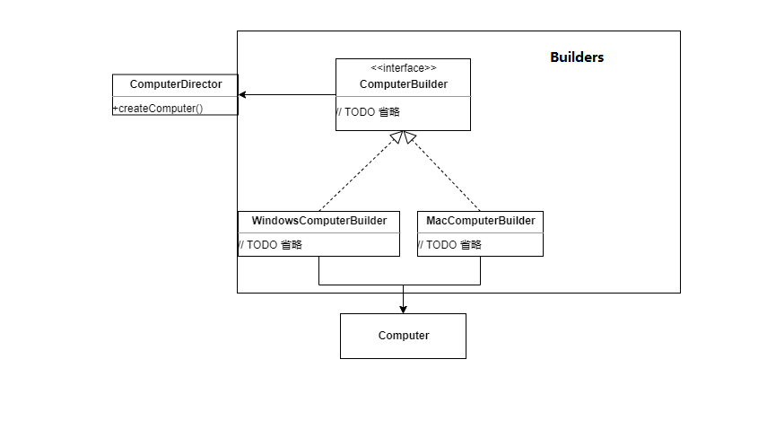

# 生成器(Builder、建造者)
[返回首页](../../../../../README.md)
- [目的](#目的)  
- [类图](#类图)  
- [例子](#例子)  
- [Builder代码示例](#Builder代码示例)  
    * [ComputerBuilder](#ComputerBuilder)  
    * [ComputerDirector](#ComputerDirector)  
    * [MacComputerBuilder](#MacComputerBuilder)  
    * [WindowsComputerBuilder](#WindowsComputerBuilder)  
    * [Java示例的类图](#Java示例的类图)  
- [Java源码中生成器模式的案例](#Java源码中生成器模式的案例)  
    * [源码中Builder的类图](#源码中Builder的类图)
    
    
# 目的
将一个复杂对象的构建与他的表示分离，使得同样的构建过程可以创建不同的表示。  
将复杂的内部创建封装在内部，对于外部调用的人来说，只需要传入建造者和建造工具，对于内部是如何建造成成品的，调用者无需关心。  
# 类图
  
Builder：为创建一个Product对象的各个部件指定抽象接口。  
ConcreteBuilder：实现Builder接口以构造和装配各个部件。提供一个检索产品的接口。  
Director：构造一个使用Builder接口的对象。  
Product：表示被构造的复杂对象  
注:在Builders中的组件加在一起就是一个生成器
# 例子
如果我们有一个对象电脑(Computer),其中有属性系统(system),机箱(box),屏幕(screen)  
```java
package establish.builder.csdn;
// 电脑
public class Computer {
    // 系统
    private String system;
    // 机箱
    private String box;
    // 屏幕
    private String screen;
    // TODO 省略get set toString
}
```
我们该如何生成这样一个对象呢，下面写一个简单的例子:  
```java
public class Test2 {
    public static void main(String[] args){
        Computer computer = new Computer();
        computer.setSystem("Mac OS");
        computer.setScreen("Mac screen");
        computer.setBox("Mac box");
        System.out.println(computer);
    }
}
```
能够发现如果属性量不断的上升这个代码量也会不断上升，那么Builder就能很好的解决这个问题。  
# Builder代码示例  
## ComputerBuilder
首先将设置属性抽象成接口[ComputerBuilder.java](csdn/builder/ComputerBuilder.java):  
```java
/**
 * 电脑生成器接口
 */
public interface ComputerBuilder {
    void builderComputer();
    void builderSystem();
    void builderBox();
    void builderScreen();
    Computer getComputer();
}
```
## ComputerDirector  
调用具体建造者角色以创建产品对象[ComputerDirector.java](csdn/ComputerDirector.java):  
```java
/**
 * 调用具体建造者角色以创建产品对象
 */
public class ComputerDirector {
    // 生成电脑
    public Computer createComputer(ComputerBuilder builder) {
        builder.builderComputer();
        builder.builderBox();
        builder.builderScreen();
        builder.builderSystem();
        return builder.getComputer();
    }
}
```
## MacComputerBuilder
Mac电脑的生成器[MacComputerBuilder.java](csdn/builder/MacComputerBuilder.java)
```java
/**
 * Mac电脑Builder
 */
public class MacComputerBuilder implements ComputerBuilder {
    private Computer computer;
    public void builderComputer() {
        this.computer = new Computer();
    }
    public void builderSystem() {
        this.computer.setSystem("Mac OS");
    }
    public void builderBox() {
        this.computer.setBox("Mac box");
    }
    public void builderScreen() {
        this.computer.setScreen("Mac screen");
    }
    public Computer getComputer() {
        return this.computer;
    }
}
```
这样在我们创建一个Mac电脑的时候无论元素多少这要创建生成器与生成工具就好了:  
```java
        MacComputerBuilder macComputerBuilder = new MacComputerBuilder();
        ComputerDirector director = new ComputerDirector();
        Computer mac = director.createComputer(macComputerBuilder);
```
## WindowsComputerBuilder
如果需要创建一个新的Windows电脑只需要实现一个ComputerBuilder就好了:  
[WindowsComputerBuilder.java](csdn/builder/WindowsComputerBuilder.java):  
```java
package establish.builder.csdn.builder;
import establish.builder.csdn.Computer;
public class WindowsComputerBuilder implements ComputerBuilder {
    private Computer computer;
    public void builderComputer() {
        this.computer = new Computer();
    }
    public void builderSystem() {
        this.computer.setSystem("windows 10");
    }
    public void builderBox() {
        this.computer.setBox("diy box");
    }
    public void builderScreen() {
        this.computer.setScreen("diy screen");
    }
    public Computer getComputer() {
        return this.computer;
    }
}
```
然后同样的调用将MacComputerBuilder修改为WindowsComputerBuilder就可以了:  
```java
        WindowsComputerBuilder windowsComputerBuilder = new WindowsComputerBuilder();
        ComputerDirector director = new ComputerDirector();
        Computer mac = director.createComputer(windowsComputerBuilder);
```
## Java示例的类图
  
Director：ComputerDirector  
Builder：ComputerBuilder  
ConcreteBuilder：MacComputerBuilder,WindowsComputerBuilder  
Product：Computer  
# Java源码中生成器模式的案例
简单了解了Builder模式之后，让我们看一下Java源码中Builder的使用，为了凸显设计模式，在其他方面都进行了简化。  
**java.lang.Appendable**  
## 源码中Builder的类图  
  
就像之前所说的Builders中的就已经是一个Builder模式了。  
Builder：Appendable为创建一个对象有各种添加字符的抽象接口。  
ConcreteBuilder：AbstractStringBuilder,Writer实现Appendable接口以构造和装配各个部件。提供一个检索产品的接口(toString与flush)。  
Product：AbstractStringBuilder是生成一个字符串,Writer是将添加至缓存的字符刷新,OutPutStreamWriter中的实现是将字符刷新至本地文件。  
可以看到在上面的图里并没有之前图里的Director去使用Appendable，那么我们就自己写一个:  
```java
public class Director {
    public Appendable create(Appendable builder) throws IOException {
        builder.append("hello");
        builder.append(" ");
        builder.append("word");
        builder.append("123",0,1);
        return builder;
    }
}
```
使用Builder生成对象:  
```java
public class Test {
    public static void main(String[] args) throws IOException {
        Director director = new Director();
        // 使用StringBuilder构建一个字符串
        StringBuilder builder = (StringBuilder) director.create(new StringBuilder());
        // 获得产品字符串
        String str = builder.toString();
        // 使用OutputStreamWriter向文件中构建字符串
        OutputStreamWriter writer= (OutputStreamWriter)director.create(
                new OutputStreamWriter(new FileOutputStream("E:\\jt\\jt-808-protocol\\mengyan-web-test\\src\\main\\java\\com\\mengyan\\appendable\\test.txt"))
        );
        // 将缓存中的字符串存入文件
        writer.flush();
    }
}
```